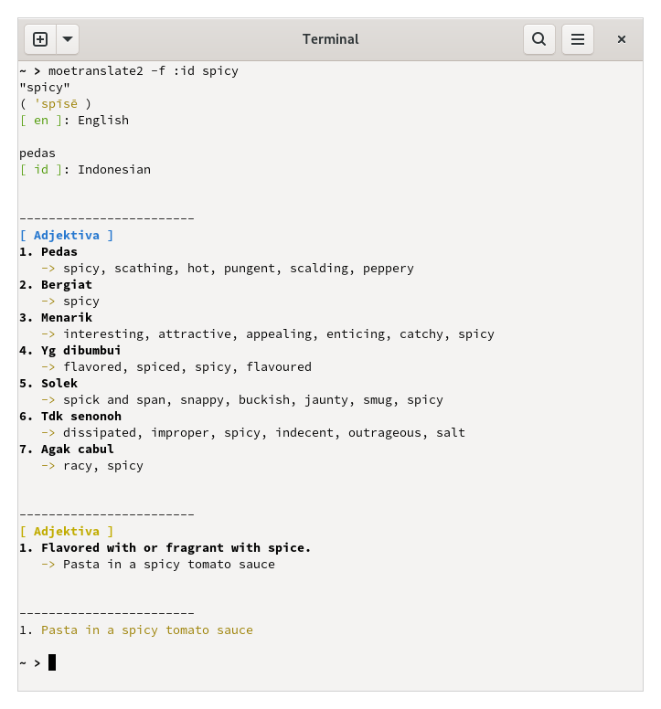

# moetranslate2
A beautiful and simple language translator written in Zig




## Currently Supported:
1. Google Translate API

## Required Package(s):

```
libedit (https://thrysoee.dk/editline/)
```

## How to Install:

```
zig build -Drelease-safe -p /usr

# OR

zig build -Drelease-fast -p /usr
```

## How to Uninstall:

```
zig build uninstall -p /usr
```

## How to Use:

```
moetranslate2 [OPT] [SOURCE:TARGET] [TEXT]

-b    Brief output.
-f    Full/detail output.
-r    Raw output (json).
-d    Detect language.
-i    Interactive input mode.
-h    Show help.
```


1. Brief output:
	`moetranslate2 -b auto:id "Hello world\!"`

	`auto` -> automatic detection

	`id`   -> Indonesian language code
2. Full/detail output:
	`moetranslate2 -f en:id "Hello wrld\!"`

	`en`   -> English language code

	Will show translated WORD/SENTENCE with more information.
3. Interactive input mode:
	```
	moetranslate2 -i
	moetranslate2 -i -f auto:en hello
	moetranslate2 -if auto:en
	```
4. Show help:
	`moetranslate2 -h`

## Language Code:
https://cloud.google.com/translate/docs/languages

## License
MIT
